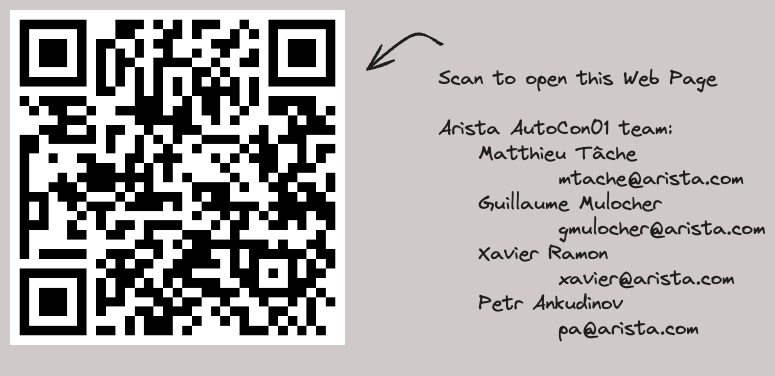

---
hide:
  - navigation
  - toc
---

# ARISTA at AutoCon01

[Start EVPN Network powered by AVD and ANTA on Codespaces](https://codespaces.new/arista-netdevops-community/one-click-se-demos?quickstart=1&devcontainer_path=.devcontainer%2Fcvaas-cvaas-and-avd-demo--evpn-mlag%2Fdevcontainer.json){ .md-button .md-button--primary target=_blank}

> Please check the [lab documentation](https://arista-netdevops-community.github.io/one-click-se-demos/cvaas-cvaas-and-avd-demo--evpn-mlag/cvaas-cvaas-and-avd-demo--evpn-mlag/) before running it as well as essential instructions [here](https://arista-netdevops-community.github.io/one-click-se-demos/) and Github Codespace [docs](https://github.com/features/codespaces).

{ width="80%" }
